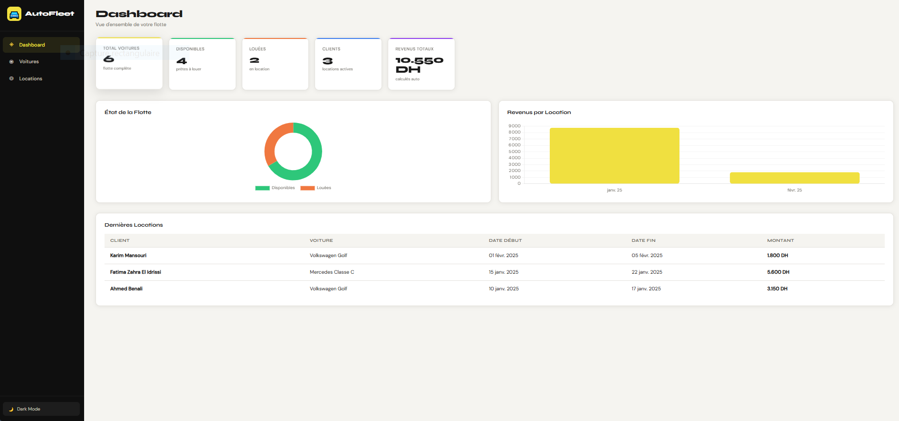

# 🚘 AutoFleet — Système de Gestion de Flotte Automobile

> Application web complète de gestion de voitures et de locations, construite avec HTML, CSS et JavaScript pur — sans frameworks.

---

## 📸 Aperçu du Projet



---

## 📋 Description

**AutoFleet** est une application de gestion de flotte automobile moderne et responsive. Elle permet aux gestionnaires de suivre leurs véhicules, gérer les locations, calculer automatiquement les revenus et visualiser les statistiques en temps réel — le tout sans base de données ni serveur, grâce au **LocalStorage**.

---

## ✨ Fonctionnalités

### 🏠 Dashboard
- Cartes statistiques : total voitures, disponibles, louées, clients, revenus totaux
- Graphique **Donut** — état de la flotte (disponibles vs louées)
- Graphique **Barres** — revenus par mois (6 derniers mois)
- Tableau des **5 dernières locations**

### 🚗 Gestion des Voitures
- Ajouter / Modifier / Supprimer une voiture
- Champs : Marque, Modèle, Année, Prix/Jour, État
- Recherche en temps réel et filtre par état
- Tri multi-colonnes (marque, modèle, année, prix)
- Badges colorés : 🟢 Disponible / 🟠 Louée

### 📋 Gestion des Locations
- Créer / Modifier / Supprimer une location
- Sélection uniquement des **voitures disponibles**
- Calcul automatique du montant (jours × prix/jour)
- Mise à jour automatique de l'état de la voiture
- Recherche et tri des locations

### 🎨 Design & UX
- Interface **dark sidebar** avec accent jaune (#F0E040)
- **Dark Mode** toggle persistant
- Modals pour tous les formulaires
- Toast notifications pour chaque action
- Validation JS complète des formulaires
- Design **100% responsive** (desktop + mobile)

### 💾 Stockage
- **LocalStorage** — données persistantes entre sessions
- Données de démonstration pré-chargées au premier lancement

---

## 🛠️ Technologies Utilisées

| Technologie | Usage |
|---|---|
| **HTML5** | Structure sémantique |
| **CSS3** | Flexbox, Grid, Variables CSS, Animations |
| **JavaScript ES6+** | Logique métier, DOM, LocalStorage |
| **Chart.js v4** | Graphiques interactifs |
| **Google Fonts** | Syne (titres) + DM Sans (corps) |

---

## 📁 Structure du Projet

```
autofleet/
│
├── index.html       # Structure HTML — pages, modals, sidebar
├── style.css        # Design complet — thème, responsive, dark mode
├── script.js        # Logique JS — CRUD, graphiques, validation
├── screenshot.png   # Capture d'écran du dashboard
└── README.md        # Documentation du projet
```

---

## 🚀 Installation & Utilisation

**Aucune installation requise.** Le projet fonctionne directement dans le navigateur.

```bash
# 1. Télécharger ou cloner le projet
git clone https://github.com/votre-user/autofleet.git

# 2. Ouvrir le fichier principal
open index.html
# ou simplement double-cliquer sur index.html
```

> ✅ Compatible avec tous les navigateurs modernes (Chrome, Firefox, Edge, Safari)

---

## 📱 Responsive Design

| Écran | Comportement |
|---|---|
| **Desktop** (>768px) | Sidebar fixe, layout 2 colonnes |
| **Tablet** (768px) | Sidebar collapsable, grille adaptée |
| **Mobile** (<480px) | Sidebar en overlay, colonnes empilées |

---

## 💡 Points Techniques Clés

- **Génération d'IDs uniques** avec `Date.now()` + `Math.random()` pour éviter les collisions
- **Calcul automatique** du montant en temps réel lors de la saisie des dates
- **Vérification de disponibilité** — seules les voitures libres sont proposées à la location
- **Protection à la suppression** — impossible de supprimer une voiture ayant des locations actives
- **Synchronisation bidirectionnelle** — l'état d'une voiture est mis à jour automatiquement lors de la création/suppression d'une location
- **Destruction et recréation des graphiques** Chart.js pour éviter les conflits lors du changement de thème

---

## 🗂️ Données de Démonstration

Au premier lancement, 5 voitures et 3 locations sont pré-chargées :

| Marque | Modèle | Année | Prix/Jour | État |
|---|---|---|---|---|
| Toyota | Corolla | 2022 | 300 DH | Disponible |
| Dacia | Sandero | 2021 | 200 DH | Disponible |
| Volkswagen | Golf | 2023 | 450 DH | Louée |
| Renault | Clio | 2020 | 250 DH | Disponible |
| Mercedes | Classe C | 2022 | 800 DH | Louée |

---

## 🔮 Améliorations Futures

- [ ] Export PDF / Excel des rapports
- [ ] Gestion multi-utilisateurs avec authentification
- [ ] Calendrier de disponibilité des véhicules
- [ ] Notifications de fin de location
- [ ] Historique complet des transactions
- [ ] Intégration d'une API backend (Node.js / PHP)

---

## 👨‍💻 Auteur

Projet développé avec ❤️ en HTML, CSS et JavaScript pur.

---

## 📄 Licence

Ce projet est open-source — libre d'utilisation et de modification.
